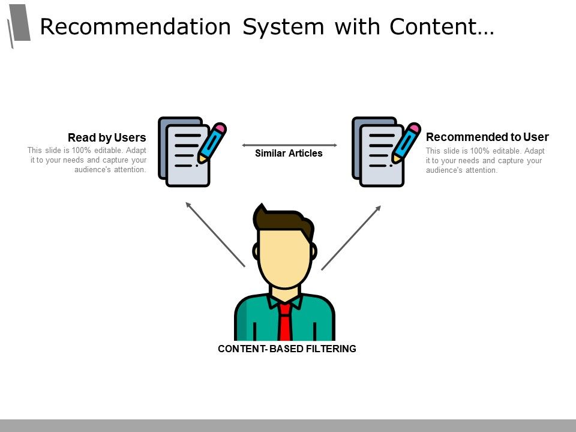
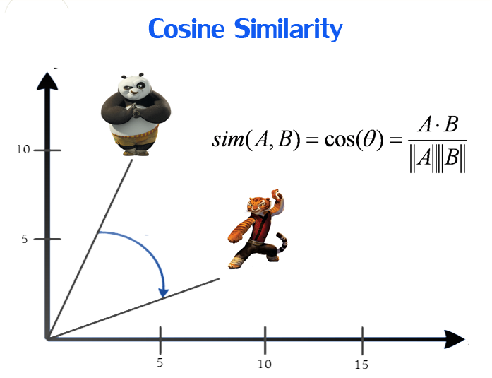

  <p align="center">
    Content Based Music Recommendation Service 
    <br />
    
</p>


<!-- TABLE OF CONTENTS -->
## Table of Contents

* [About the Project](#about-the-project)
  * [Content Based Filtering](#Content-Based-Filtering)
  * [Cosine Similarity](#Cosine-Similarity)
  * [Advantages](#Advantage-over-Collaborative-Filtering)
* [Getting Started](#getting-started)
  * [Prerequisites](#prerequisites)
  * [Installation](#installation)
* [Usage](#usage)
* [Roadmap](#roadmap)
* [Contributing](#contributing)
* [Contact](#contact)


<!-- ABOUT THE PROJECT -->
## About The Project

[![Product Name Screen Shot][product-screenshot]](https://example.com)

<strong>Content Based Recommendation Service</strong> which suggests songs similar to the one chosen by the user. It has approximately *160,000 songs* in its database and takes about *300ms to generate recommendations*. 

## Following are some core concept on which this project relies on

</br>

* ### Content Based Filtering

Content-based filtering uses item features to recommend other items similar to what the user likes, based on their previous actions or explicit feedback.



<br />

* ### Cosine Similarity

Cosine similarity measures the similarity between two vectors by calculating the cosine of the angle between them. A simple visualization and the formula can be found below.



<br />


### Advantage over Collaborative Filtering
<p>
  Recommendation engines that run on collaborative filtering recommend each item (products advertised on your site) based on user actions. The more user actions an item has, the easier it is to tell which user would be interested in it and what other items are similar to it. As time progresses, the system will be able to give more and more accurate recommendations.
</p>
<p>
  This, however, brings a major contradiction and difficulty to classified sites and their recommendation engines. Even though a new song can  actually be the the most relevant one to a user, a recommendation system has far less confidence in recommending them  than it has with older songs, but it’s just simply not a good idea to let songs ads dominate the recommendation process.
</p>

<p>

  Similarly newer users cannot be provided with accurate recommendations until the user has made few choices himself/herself which will tune the recommendation algorithm.

## Built With

</br>

<p float = "left">


</p>


<!-- GETTING STARTED -->
## Getting Started

To get a local copy up and running follow these simple example steps.

### Prerequisites

* React
* Python 3.6+


### Installation 

<br />

#### Flask API
<br />

1. Clone the repo 
```sh
git clone https://github.com/radioactive11/rezonance
```

2. Install requirements
```sh
pip3 install -r requirements.txt
```

3. Start Flask server (by default at `localhost:5000`)
```sh
python3 app.py
```

<br />

#### React 

<br />

1. Clone the repo 
```sh
git clone https://github.com/radioactive11/rezonance
```

2. Install required packages
```sh
cd client
npm install
```

3. Start React Development server (by default at `localhost:3000`)
```sh
npm start
```

<br />


<!-- USAGE EXAMPLES -->
## Usage


* ### Visit the [website](https://rezonance.vercel.app) and click on get started


* ### Enter name of Song or Artist name,  for which you want similar songs, to search. Click on a card to chose a song.


* ### In the recommendation page, click on a song to listen to a 30 second preview of the song. Click again on the card to pause it. 

*NOTE: some songs do not have a preview due to copyright issues.*


<!-- ROADMAP -->
## Roadmap

See the [open issues](https://github.com/radiaoctive11/rezonance/issues) for a list of proposed features (and known issues).


<!-- CONTRIBUTING -->
## Contributing

Contributions are what make the open source community such an amazing place to be learn, inspire, and create. Any contributions you make are **greatly appreciated**.

1. Fork the Project
2. Create your Feature Branch (`git checkout -b feature/AmazingFeature`)
3. Commit your Changes (`git commit -m 'Add some AmazingFeature'`)
4. Push to the Branch (`git push origin feature/AmazingFeature`)
5. Open a Pull Request


